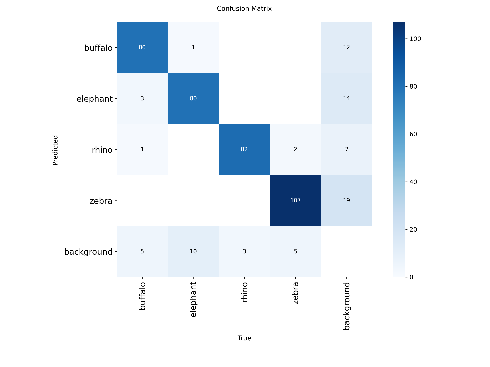
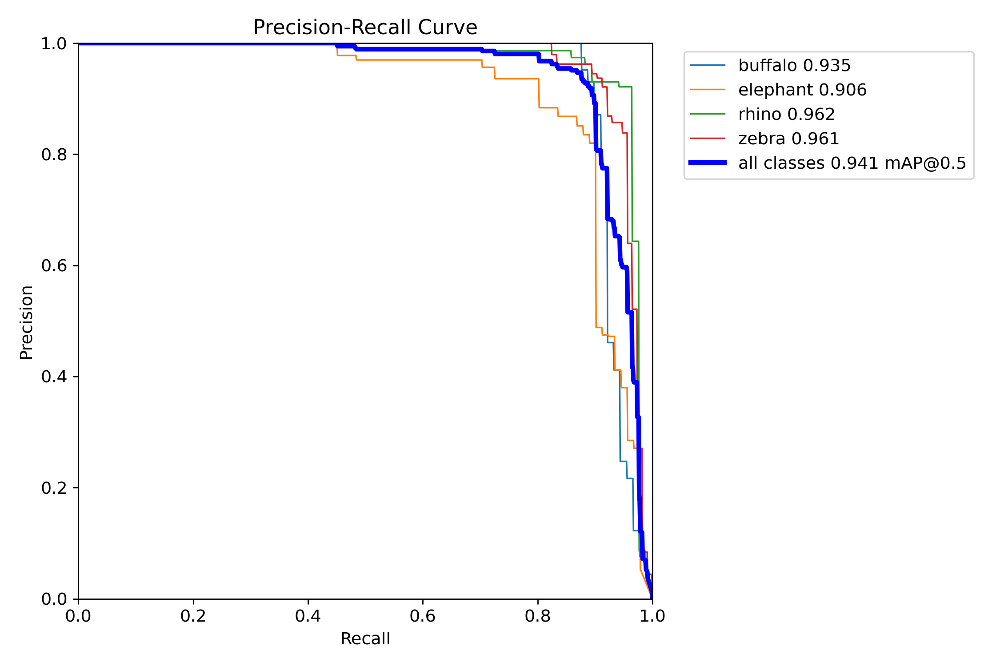

# IIIT-Hyd-Summer-Internship-2025

Projects and research contributions during the IIIT Hyderabad Summer Internship 2025.

---

## YOLOv8 Animal Detection Project

This project was developed as part of the IIIT Hyderabad Summer Internship 2025.

## Project Summary
- Object detection using Ultralytics YOLOv8
- Custom wildlife dataset (e.g., elephant, buffalo, zebra, rhino)
- Trained for 20 epochs
- Evaluated using mAP, Precision, Recall, F1_curve and Confusion Matrix

## Sample Outputs

### Confusion Matrix


### PR Curve


### Sample Prediction


## Run Inference

```bash
yolo task=detect mode=predict model=weights/best.pt source=runs/detect/train/images/value_batch1_labels.jpg
